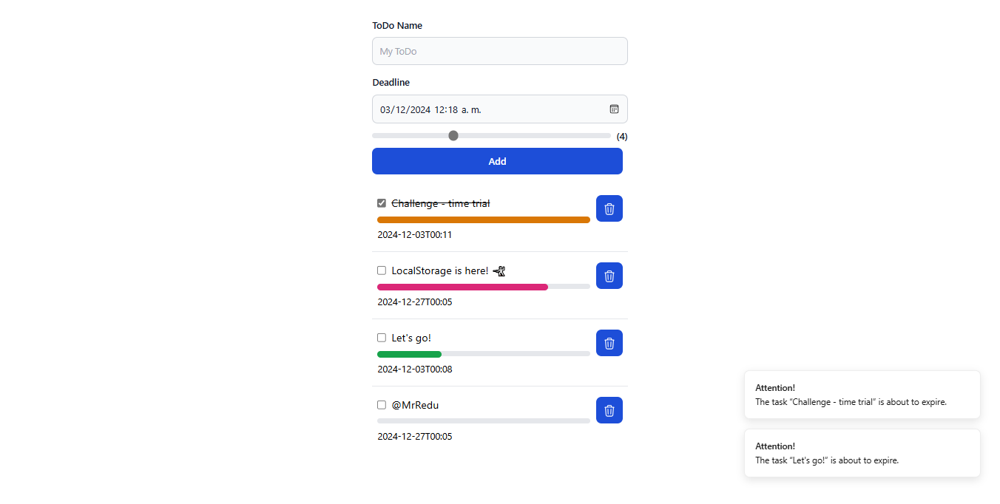

# 25. To-Do List with Reminders

A simple to-do list app where users can create tasks, set deadlines, and receive reminders. Ideal for beginners learning CRUD and local storage.

### Features

- Add, edit, and delete tasks
  - [x] Add
  - [x] Edit
  - [x] Delete
- Set deadlines and receive notifications
  - [x] Set deadlines
  - [x] Receive notifications
- Mark tasks as **completed**
  - [x] isCompleted
- Priority-based task sorting

### Tech Stack

- React.js
- TypeScript
- Local Storage
- Notification API
- Tailwind CSS

### Level

Beginner 🤺

### Learning Path

CRUD operations, local storage for data persistence, and notifications.

### Open-source Focus

Allows contributors to add features like color-coded priority levels, sub-tasks, and recurring reminders.

# Result

